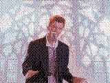

<h1 align="center">PIC2MKCAPIX</h1>
<h2 align="center">Convert Picture to Makecode-arcade or Pixel-art</h2>

visit at [page](https://quarequin.github.io/pic2mkcapix)

download offline at [here](https://github.com/Quarequin/pic2mkcapix/releases/latest/download/IM2MKCA.htm)

download source at [here](https://github.com/Quarequin/pic2mkcapix/raw/refs/heads/main/pack/IM2MKCAS.zip)
<dl>
<dt> note for anti-ai user:</dt>
<dd> this project use <i>ai</i> to make project but you can fork this to make as human code sorry. :(</dd>
</dl>

Offline picture-to-MakeCode/pixel-art converter with modular source files and a standalone build.

Open `index.htm` for the modular version or `IM2MKCAS.htm`/`IM2MKCA.htm` for the self-contained standalone version.

Animated GIF, APNG, WebP, and WebM sources are decoded into composited frames. Frames whose file data updates only a rectangle are composited over the latest full frame before conversion. Downloading a converted animation exports a GIF containing the processed frames.
